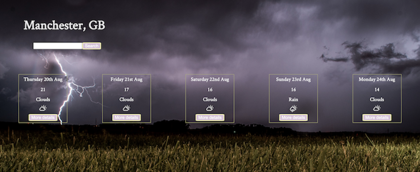
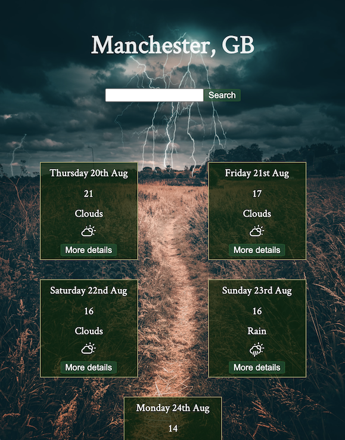

# React Weather Application

Part of my studies at Manchester Codes, I have been asked to build a weather application which is :
+ Using External Data 
+ Allow users search by cities
+ Displays 5 days of weather forecast
+ Allows users to see more detailed forecast by clicking on each day

### Built with
+ React
+ CSS

### Testing
+ React testing Libary

### Design 

On Computer and Mobile

## Author
Szabina Kovacs

### Deployed
[Weather App](https://weather-app-ochre-two.vercel.app/)
